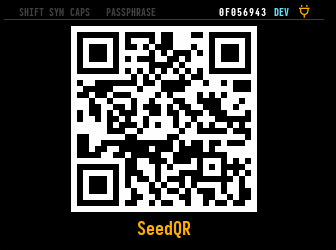
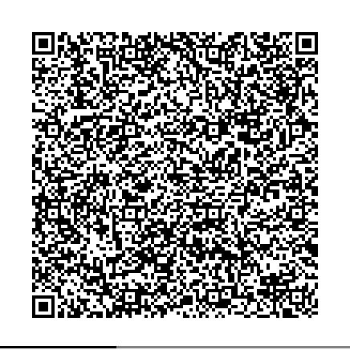

# BBQr - Better Bitcoin QR

Encodes larger files into a series of QR codes so they can cross air gaps.

Project Status: **New & proposed --- looking for feedback**

[Project Home on Github](https://github.com/coinkite/BBQr)

# Specification

See full spec [BBQr.md](BBQr.md).

# Summary

This protocol enables files larger than can fit into a single QR
to be sent as a series of QR codes (sometimes called an "animated
QR"). The target file types are PSBT (BIP-174) and signed Bitcoin
transactions, but it also supports CBOR, JSON and Text options for
general purpose use.

We carefully consider the data inside QR codes, and apply a
deep knowledge of how QR codes work, so that no pixel nor byte
is ever wasted! Internally it supports HEX and Base32 serializations
and a constrained ZLIB option for data compression. This is all
done with an eye to embedded implementations on very contrained
devices (ie. hardware wallets), which may not have enough memory
to keep more than a single QR code around.

Here are some compression numbers, using the ZLIB encoding option.
Even though Bitcoin files have relatively high entropy (with hashes
and UTXO's being non-compressable) we still see 30% typical size
reduction.

File (see testing/data) | Before | After | Compression Ratio
------------------------|--------|-------|------------------
1in1000out.psbt         |  35644 | 22095 |  38.0%
1in100out.psbt          |   4142 | 2654  |  35.9%
1in10out.psbt           |    992 | 670   |  32.5%
1in20out.psbt           |   1342 | 897   |  33.2%
1in2out.psbt            |    675 | 458   |  32.1%
devils-txn.txn          |    666 | 356   |  46.5%
finalized-by-ckcc.txn   |   1932 | 807   |  58.2%
signed.txn              | 100757 | 77090 |  23.5%

By using Base32 character encoding inside a QR code with the unique
"alphanumeric" encoding (where each character takes 5.5 bits of
space, and encodes 5 bits of binary), we can acheive the smallest
possible QR codes.

The largest possible (uncompressed) data payload in 3,470,600 bytes
spread across in 1,295 version 40 QR codes.

# Example Image


The above BBQr encodes the entire specification itself (so meta). 

```
% bbqr make BBQr.md -v 21 -o example.png --scale 3
Detected file type: U -> Unicode Text
Need 8 QR's each of version 20.
Building QR images... done!
Created 'example.png' with 8 frames.
```

# Code Examples

- Splitting QRs: [Python](python/bbqr/split.py), [JS](js/src/split.ts)
- Joining QRs: [Python](python/bbqr/join.py), [JS](js/src/join.ts)
- Binary to internal encoding: [Python](python/bbqr/utils.py), [JS](js/src/utils.ts)
- Wrapper CLI: [Python](python/bbqr/cli.py)

# License

Public Domain code by [Coinkite](https://coinkite.com)


## Useful Pipelines

These will load your clipboard with example data suitable for the COLDCARD Q Simulator.

See also [`psbt_faker`](https://github.com/Coldcard/psbt_faker)

```
% psbt_faker - | bbqr make - -t P | pbcopy
A single QR version 18 will be needed.

% bbqr make - --fake-data 2048000 -t P | pbcopy
A single QR version 35 will be needed.

% psbt_faker -n 200 - | bbqr make - -t P -r | pbcopy
Need 5 QR's each of version 37.
```

These are round-trip examples, where encode and decode are performed.

```
% psbt_faker -n 10 - | bbqr make - -t P -r | bbqr decode
A single QR version 25 will be needed.
PSBT File:
cHNidP....

```

## Signing Transaction with COLDCARD Q

1) Using **COLDCARD Q** choose `Scan Any QR Code` from main menu and scan this Seed QR
   to temporarily import a new seed:



```patch
- This seed is the COLDCARD simulator key and is well known!
- DO NOT send any funds to this seed.
```

2) Confirm import of temporary seed and if **Seed Vault** is enabled you may save it there
   (not required).
    
3) Navigate to `Scan Any QR Code` again, and scan either of these transactions. You'll
   be shown the details, and if accepted, the signed result will be shown as BBQr.

### PSBT: Basic 1 input 2 outputs


### PSBT: 10 in, 2 out with Locktimes


